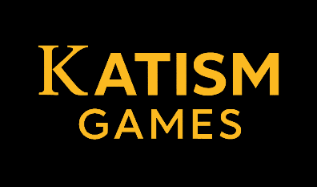
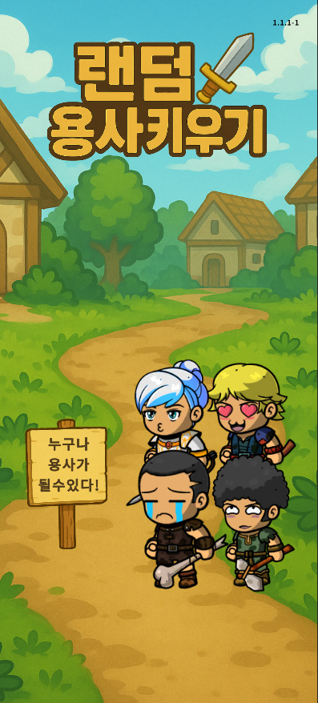
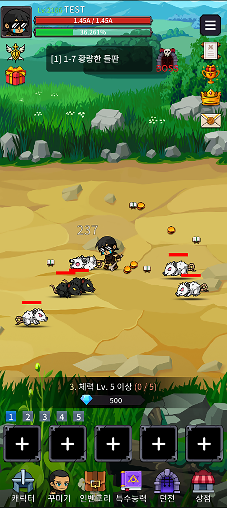

# Random Hero Idle RPG

  

Random Hero Idle RPG is a global idle RPG set in the “Great Hero Era,” where the sudden appearance of mysterious posters sparks a world in which anyone can rise as a hero to fight invading otherworldly monsters.

  

This repository contains the backend services and tools for the game, built and operated by **Katism Games**, a one-person indie studio based in South Korea.

## 1. Project Overview

- **Genre**: Idle RPG
- **Platforms**: Android (global release planned), iOS later
- **Target Regions**: North America (primary), Korea (secondary), global support
- **Status**: In development, preparing for soft launch and global launch

### Screenshot

  

## 2. Core Features

- Become a randomly chosen hero and progress automatically through stages  
- Growth system based on upgrading stats, equipment, and passive bonuses  
- Weekly and seasonal ranking systems  
- Offline rewards and progression  
- Secure in-app purchase system (Google Play / Apple Store receipt verification)  

## 3. Tech Stack

- **Client**: Unity 6 (C#)  
- **Backend**: PHP 8.3 / Laravel  
- **Database**: MySQL (partitioned per month for logs and rankings)  
- **Cache / Queue**: Redis  
- **Infrastructure (planned)**: AWS (EC2 or Lightsail, S3, CloudFront, etc.)

## 4. Architecture (High Level)

- REST API backend for all client communication  
- Laravel-based operations/admin tool for managing players, rewards, logs, and events  
- Scheduled jobs for ranking resets, mail distribution, and background tasks  
- Receipt verification system for Play Store and App Store purchases  

## 5. Roadmap

- 2025 Q3: Closed testing and infrastructure setup  
- 2025 Q4: Soft launch in selected regions  
- 2026 Q1: Global launch on Google Play  

## 6. About Katism Games

Katism Games is a one-person indie studio founded by a game client programmer with experience in Unity and backend development.  
The studio focuses on creating stylized idle RPGs with long-term LiveOps support and global availability.

- **Business type**: Sole proprietor (individual business)  
- **Location**: South Korea  

## 7. Contact

- **Email**: katismgames@gmail.com
